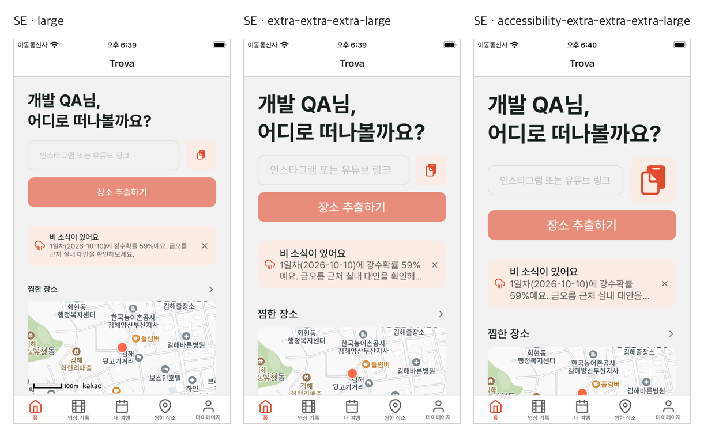

# uiflow

앱 화면 **디자인 QA를 반복할 때 손으로 하던 일**을 묶은 Claude Code 플러그인입니다.
[devflow](https://github.com/taehyeooo/devflow)(배포·QA·기록)와 짝이고, 화면이 있는 프로젝트에만 설치하면 됩니다.

| 구성 | 종류 | 하는 일 |
|---|---|---|
| `after-edit-check` | 훅(PostToolUse) | 앱 코드(.ts/.tsx)를 고친 직후 타입 검사·디자인 토큰 검사를 돌려, 실패하면 그 자리에서 Claude에게 돌려줌 |
| `design-sweep` | 스킬 + 스크립트 | 지금 화면을 글자 크기별(보통·큰 글자·접근성 최대), 선택적으로 다크 모드까지 캡처해 한 장으로 |
| `design-compare` | 스킬 + 스크립트 | 같은 화면의 고치기 전·후를 나란히 붙인 비교 이미지 |
| `design-qa` | 스킬 | 상태(빈·하나·여러 개·긴 제목·진행 중·오류) × 체크리스트(잘림·위계·정렬·큰 글자·터치·문구)로 QA, "찾은 것 → 고친 것" 표 |



## 어떤 서비스에서도
- 수정 후 검사 훅: 검사 명령(`checks`)과 대상 파일 패턴(`checkFiles`)을 설정으로 — 어떤 언어·프레임워크든 명령만 바꾸면 됨
- 화면 훑기·전후 비교: 지금은 iOS 시뮬레이터(`xcrun simctl`) 기준. 웹·안드로이드는 같은 틀에 캡처 도구만 바꿔 넣을 예정

## 설치
```
/plugin marketplace add taehyeooo/uiflow
/plugin install uiflow@uiflow
```

## 설정
`~/.config/uiflow/<origin 레포 이름>.json` — 레포 밖에 둡니다. 예시: [`examples/config.example.json`](examples/config.example.json).
`checks`가 없는 레포에서는 훅이 아무것도 하지 않습니다. 이미지 합치기는 Python Pillow를 쓰고, 없으면 캡처 파일 목록만 남깁니다.

## 사용 기록
[docs/usage-trova.md](docs/usage-trova.md)
